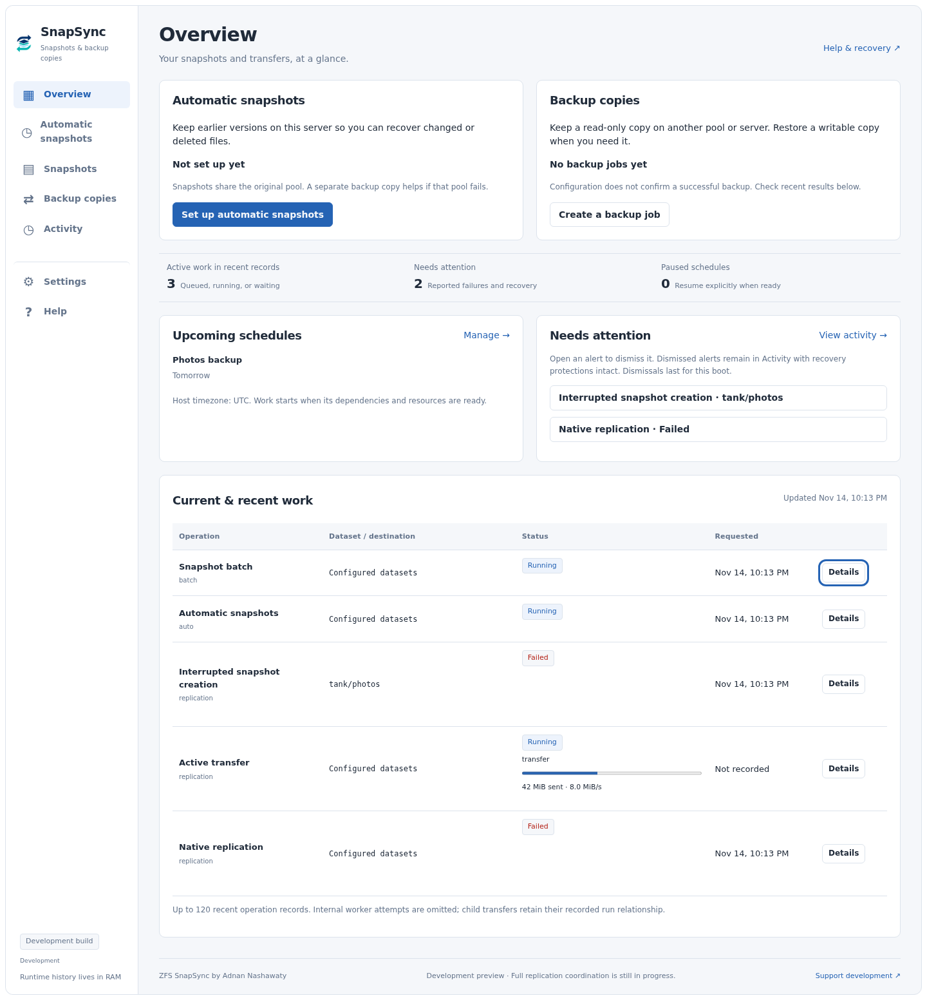
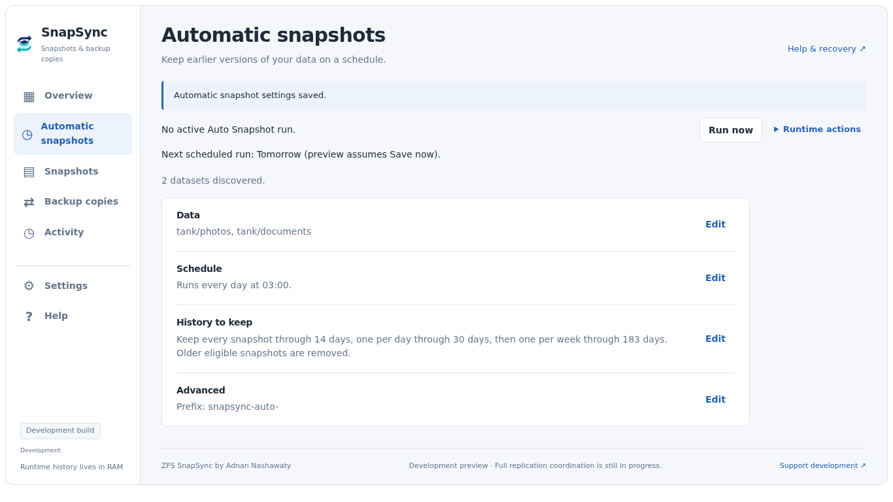
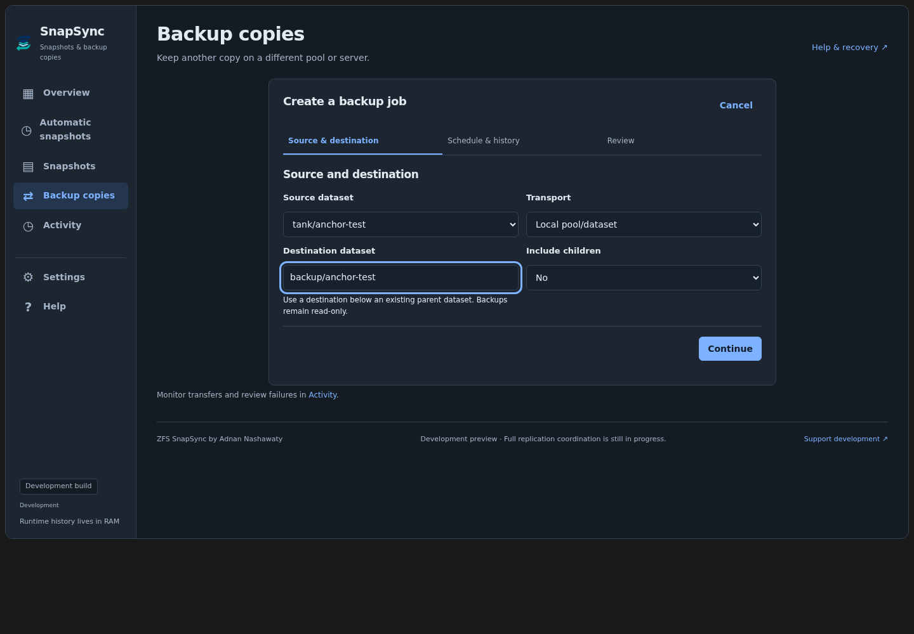

# ZFS SnapSync for Unraid


Manage snapshots, replicate datasets, and follow storage operations from one Unraid WebGUI. ZFS SnapSync brings scheduled snapshots, retention cleanup, local replication, snapshot browsing, and dataset migration into a shared workspace.

**Current testing release: `2026.09.22.04` · Requires Unraid 6.12.0 or newer**

SnapSync is a standalone plugin under active development. Local replication uses the new coordinator; network replication and some recovery integration remain unfinished. Start testing with disposable datasets. See [Testing and known limitations](#testing-and-known-limitations) before enabling unattended work.

## Install and update

In **Plugins → Install Plugin**, paste this URL:

```text
https://raw.githubusercontent.com/adnanklink/zfssnapsync-unraid/main/dist/zfs.snapsync.plg
```

Open **Settings → ZFS SnapSync** after installation. Future builds appear through **Plugins → Check for Updates**. The install and update manifest now tracks `main`; this remains a development release with the limitations listed below. Existing SnapSync testing-channel clients receive an update that switches them to `main`. This manifest installs the standalone `zfs.snapsync` plugin.

Stop snapshot, replication, and migration work before installing or updating. If you have ZFS Auto Snapshot installed, disable its schedules and stop its workers before using SnapSync on the same datasets. The plugins have separate configuration and do not coordinate their operations. SnapSync does not import the other plugin's settings, queues, or approvals, and installing it does not remove the other plugin.

## Get started

1. Open **Snapshots → Automation** and select a test dataset.
2. Review its snapshot prefix, retention windows, and free-space target.
3. Use Auto Snapshot's **Dry Run** to inspect planned actions before enabling its schedule.
4. Save settings, then use **Run Now** or wait for the first scheduled occurrence.
5. Follow the run in **Activity** and inspect its snapshots under **Snapshots**.
6. To test replication, add a local job under **Replication**, save it, and run it against a disposable destination.

New installations start with no Auto Snapshot datasets selected and its schedule disabled. Save or discard pending settings before Run Now. Dry Run applies to Auto Snapshot; it is not a global simulation mode for replication or migration.

## The workspace

| Section | What you can do |
| --- | --- |
| **Overview** | See current operations, schedule state, and unavailable services. |
| **Snapshots** | Browse and filter snapshots, review bulk actions, preview cleanup, and configure Auto Snapshot. |
| **Replication** | Add or edit send jobs, configure retention and connections, and start runs. |
| **Activity** | Follow running work, dependency waits, failures, cancellation, and available recovery actions. |
| **Tools** | Preview dataset migrations and download diagnostics. |
| **Help** | Find guidance and support links. |

Activity shows native replication phases and, for new transfers, estimated stream progress, bytes sent, and sampled send speed. Percentages are estimates for the reported transfer, not an overall recursive-job completion guarantee; receiver verification still determines success. Older workers and network paths may provide fewer metrics.

The interface adapts to light and dark Unraid themes and smaller screens. Runtime views describe the current boot, not a permanent historical ledger.

## Screenshots

Captured from the current interface using demo datasets and operation records, without the surrounding Unraid navigation. These illustrate the UI, not a live server’s status.

**Overview** — current work, schedules, and operations that need attention.



<details>
<summary>Snapshot automation: dataset selection and retention settings</summary>



</details>

<details>
<summary>Replication in the dark theme</summary>

An example local replication job being configured before Save.



</details>

## Snapshots and retention

Auto Snapshot creates snapshots for selected datasets and applies three retention windows. Defaults are:

| Snapshot age | Normal retention |
| --- | --- |
| Up to 14 days | Keep every snapshot. |
| After 14 days, through 30 days | Keep one per day. |
| After 30 days, through 183 days | Keep one per week. |
| Older than 183 days | Eligible for cleanup, subject to protection checks. |

Configure these windows in the WebGUI. Automatic cleanup uses managed snapshot prefixes and excludes protected snapshots. Holds, clones, replication references, and incomplete metadata can prevent deletion.

Auto Snapshot's free-space cleanup is separate from age-based retention. It can consider eligible snapshots from other selected datasets on the same pool when they can relieve the relevant space constraint. Unselected datasets are excluded. Local replication has a narrower policy, described below.

### Browse and review actions

Snapshot Manager works on one dataset at a time, with search, filters, and pagination. It supports large inventories and selections across pages. **Select all matching** captures a fixed set of snapshot identities; snapshots created afterward do not join that selection.

- Bulk Delete, Add plugin hold, and Release plugin hold require review of the selected snapshots. External holds cannot be released by SnapSync.
- Send and Rollback act on a single selected snapshot. Rollback refuses to remove newer, unselected snapshots.
- Cleanup previews make no changes, expire after five minutes, and bind approval to exact names and GUIDs. Changed configuration or identities require review or cause items to be skipped.
- Explicit requests contain at most 500 identities, and batches execute in chunks of at most 50. Failed-only retry opens a fresh review.

**Used** and **Written** are different ZFS measurements. Zero does not mean a snapshot is empty, and Written totals do not predict how much space deletion will reclaim.

## Replication

A replication job specifies a source, destination, schedule, whether to include child datasets, and a destination free-space target. Add or edit a job, choose **Done**, then **Save replication**. Monitor execution in **Activity**.

Local scheduled jobs and configured-job Run Now use coordinator-owned preparation, cleanup, space checks, transfer, and verification. Recursive membership is captured for the run, and every expected child must report verified success before the run completes. Snapshot Manager also supports explicit local sends and validated Retry of interrupted receives.

Replication checkpoints use a separate prefix from Auto Snapshot. The defaults are `snapsync-auto-` and `snapsync-send-`. Prefixes must differ and neither may begin with the other. Changing a prefix does not rename or delete existing snapshots.

SnapSync verifies destination identity, snapshot GUIDs, incremental bases, and resume targets. It does not automatically destroy a destination or force receive rollback to make a transfer succeed. An existing receiver without a suitable base requires explicit resolution.

SSH jobs currently use the existing network execution path; native coordinator SSH integration is unfinished. The incomplete spiped transport is hidden from the WebGUI. The local low-space policy below does not apply to network jobs.

### Optional low-space anchor cleanup

Local jobs default to **Preserve retained snapshots**. You can enable **Delete older retained snapshots when space is needed** for an individual job. Saving that choice authorizes future automatic removal of older daily/weekly restore points when ordinary retention cannot provide enough space.

This policy:

- Preserves every snapshot in the keep-all window, the newest checkpoint, required replication references, held snapshots, and clones.
- Considers only that job's snapshots on the exact receiving dataset. Recursive children are evaluated individually.
- Deletes eligible anchors oldest first, one at a time, and checks measured space after each deletion.
- Stops when space is sufficient or fails with a space reason when protected history or quotas prevent progress.

Space approval requires the stream estimate plus the greater of the configured free-space target, 16 MiB, or 5% of the estimate. Estimated reclaimable bytes never substitute for measuring available space.

The opt-in applies to local scheduled jobs and configured-job Run Now. It grants no cleanup authority to Snapshot Manager manual sends.

## Scheduling and cancellation

Auto Snapshot offers interval, daily, weekly, and custom five-field cron schedules. Replication offers its configured intervals and daily/weekly start-time controls, using the host timezone.

New elapsed intervals start one interval after Save. Run Now and completion times do not shift their cadence. Existing schedule formats preserve their timing until explicitly converted. Missed local scheduled occurrences coalesce into one latest catch-up; a job cannot overlap its own active run. Exhausted retries leave the occurrence accepted so it is not immediately recreated.

Canceling an automatic or configured replication run persistently pauses its schedule until **Resume**. The cancellation decision is saved before workers are signaled. Activity distinguishes that committed decision from verified worker shutdown. A snapshot already deleted before cancellation cannot be restored by canceling the run.

Configuration saves are atomic and revision checked. If another page changed the settings, reload before saving. The UI reports configuration-save success separately from scheduler-application success.

## Runtime state and recovery

Recurring queues, progress, batch manifests, and coordinator history live in RAM. Boot flash stores configuration, explicit control decisions such as Cancel/Resume, and essential migration recovery checkpoints.

| Event | What to expect |
| --- | --- |
| Coordinator restart in the same boot | RAM records can be recovered after old worker shutdown is verified. |
| Host reboot or power loss | Runtime history is lost. Automatic work plans again from current configuration and ZFS metadata. |
| Interrupted manual send | Explicit recovery review and validated Retry are required; it is not automatically resumed after reboot. |
| Interrupted snapshot batch | Review again; earlier per-item results may no longer be available. |
| Saved schedule pause | Remains paused across reboot until Resume. |

Exactly-once scheduling across reboot is not guaranteed. Discovered snapshots or resume tokens do not recreate manual execution approval.

## Dataset Migrator

**Tools → Dataset Migrator** turns top-level folders into child datasets. For example, separate application folders in an `appdata` dataset can become datasets with independent snapshot histories.

Choose a parent dataset, generate a preview, review the proposed folders, and acknowledge the plan before starting. The migrator checks names and existing datasets, records container restoration information, stops affected containers, copies data, verifies it with manifests and checksums, then restores container settings and restarts them.

Verification can take time. Stop external watchdogs that could restart containers during migration. If space becomes insufficient, the migration can wait for space before continuing. Recovery checkpoints survive reboot; recurring progress does not.

## Testing and known limitations

This testing build has passed reliability and stage-one suites, actual PHP endpoint checks, browser tests, PHP/Bash checks, ShellCheck, and package-content verification. Disposable ZFS pools have exercised transfers, cancellation and resume, low-space prerequisite cleanup, and retained-anchor deletion. Pressure fault tests cover interrupted journals, stale workers, chunk boundaries, configuration changes, cancellation between deletions, and space recovery.

The traced native anchor-cleanup fixture ran with `/boot` read-only and recorded no file-write opens or path-metadata mutation attempts on boot flash. This is scoped evidence, not verification of every plugin path.

Remaining work includes native network replication, independently shared cleanup ownership, broader automatic replanning and recovery, complete per-mutation Auto Snapshot ownership, and all-path release acceptance. These limits are tracked in the [standalone roadmap](docs/standalone-development.md), [implementation record](docs/job-coordination-progress.md), and [reliability audit](docs/reliability-audit.md).

For initial host testing, use disposable source and destination datasets. Exercise a snapshot run, a local transfer, Cancel/Resume, and recovery behavior before enabling recurring work. Keep low-space anchor cleanup off until you have reviewed its retention tradeoff.

## Unraid navigation

Enable **Tools → Interface → Show SnapSync in the Unraid navigation**, save, then select **Reload navigation**. The optional top-level tab is off by default. Its preference survives updates and reboots; the Settings entry remains available.

## Diagnostics and support

Download diagnostics from **Tools → Diagnostics** and report SnapSync problems in [this repository's issue tracker](https://github.com/adnanklink/zfssnapsync-unraid/issues).

Include the SnapSync version, Unraid version, operation involved, expected and actual behavior, reproduction steps, and the diagnostics archive. The archive includes redacted configuration, logs, runtime state, and read-only ZFS/system summaries. Review it before sharing.

## Development

The repository is `zfssnapsync-unraid`. The standalone plugin ID is `zfs.snapsync`; its configuration is under `/boot/config/plugins/zfs.snapsync/` and WebGUI files under `/usr/local/emhttp/plugins/zfs.snapsync/`.

```bash
git clone --branch main --single-branch \
  https://github.com/adnanklink/zfssnapsync-unraid.git
cd zfssnapsync-unraid

./scripts/build-release.sh <new-version> \
  https://raw.githubusercontent.com/adnanklink/zfssnapsync-unraid/main/dist
```

Update `VERSION`, [CHANGELOG.md](CHANGELOG.md), and `zfs.snapsync.plg.in` for each release. The build verifies package contents and generates the manifest, package, and icon. Commit generated artifacts separately from source changes. Building or pushing source alone does not publish an installable update.

The release workflow runs automatically on `main` and `testing`, or explicitly through workflow dispatch. Promoted releases include verified packages; the workflow validates these without replacing an existing version. Endpoint and ZFS tests require the documented disposable test environment; they use production-style paths and must not be run casually on a live Unraid host.

## Support development

ZFS SnapSync is developed by **Adnan Nashawaty**. If you find it useful, [support ongoing development on PayPal](https://www.paypal.com/paypalme/adnanklink).

## Credits

ZFS SnapSync began from **ZFS Auto Snapshot for Unraid**, created by **Brandon Stone ([bstone108](https://github.com/bstone108))**. Thank you to Brandon and the original contributors for the snapshot-management foundation this project builds on.

- [Original ZFS Auto Snapshot repository](https://github.com/bstone108/zfsautosnapshot-unraid)
- [Original Unraid community thread](https://forums.unraid.net/topic/197348-plugin-zfs-auto-snapshot/)

SnapSync is developed independently. Please report SnapSync-specific issues in this repository rather than to the original project's maintainers.

## License

[MIT License](LICENSE). Original copyright and license notices are retained.
