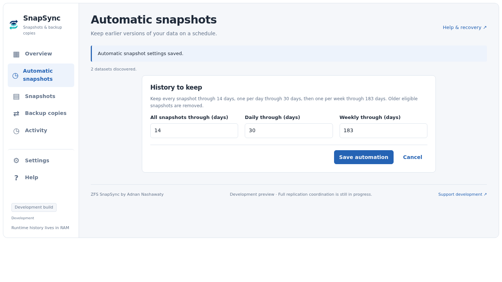
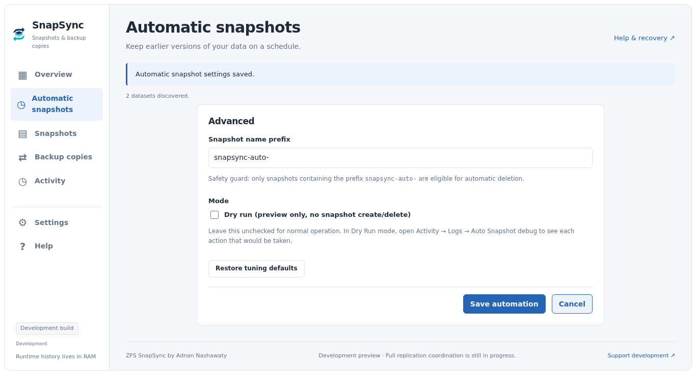
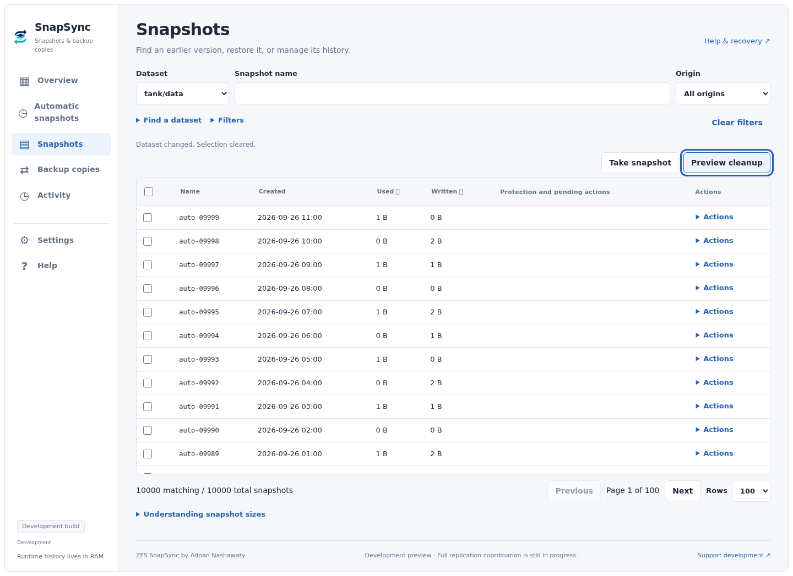
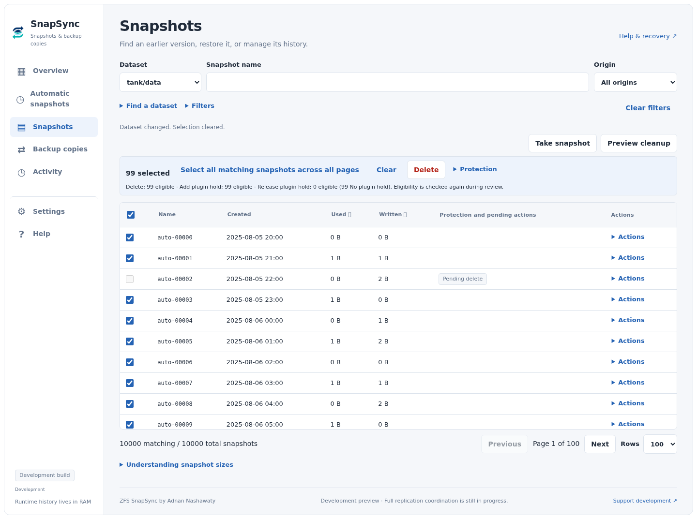

# ZFS SnapSync for Unraid


Manage snapshots, replicate datasets, and follow storage operations from one Unraid WebGUI. ZFS SnapSync brings scheduled snapshots, retention cleanup, local replication, snapshot browsing, and dataset migration into a shared workspace.

**Current testing release: `2026.09.26.02` · Requires Unraid 6.12.0 or newer**

SnapSync is a standalone plugin under active development. Local replication uses the new coordinator; network replication and some recovery integration remain unfinished. Start testing with disposable datasets. See [Testing and known limitations](#testing-and-known-limitations) before enabling unattended work.

## Install and update

In **Plugins → Install Plugin**, paste this URL:

```text
https://raw.githubusercontent.com/adnanklink/zfssnapsync-unraid/main/dist/zfs.snapsync.plg
```

Open **Settings → ZFS SnapSync** after installation. Future builds appear through **Plugins → Check for Updates**. The install and update manifest now tracks `main`; this remains a development release with the limitations listed below. Existing SnapSync testing-channel clients receive an update that switches them to `main`. This manifest installs the standalone `zfs.snapsync` plugin.

Stop snapshot, replication, and migration work before installing or updating. If you have ZFS Auto Snapshot installed, disable its schedules and stop its workers before using SnapSync on the same datasets. The plugins have separate configuration and do not coordinate their operations. SnapSync does not import the other plugin's settings, queues, or approvals, and installing it does not remove the other plugin.

## Get started

1. Open **Automatic snapshots → Set up automatic snapshots**.
2. In **Choose data**, select a test dataset and review its pool free-space target.
3. In **Schedule & history**, choose when to run and how much history to retain. Expand **Advanced: naming and Dry Run** if you want to inspect planned actions before making changes.
4. Review the settings and choose **Save automation**. Use **Run now** or wait for the first scheduled occurrence.
5. Follow the run in **Activity**, then browse its snapshots under **Snapshots**.
6. To test backup copies, open **Backup copies → Add job**. Choose a source and disposable destination, review the schedule and history settings, and choose **Create job**. **Run all jobs now** starts the saved jobs.

After setup, Automatic snapshots shows four summaries: **Data**, **Schedule**, **History to keep**, and **Advanced**. Choose **Edit** beside a section to see its fields directly, then **Save automation** or **Cancel**. There is no extra dropdown inside these section editors.

New installations start with no Auto Snapshot datasets selected and its schedule disabled. Save or discard pending settings before Run Now. Dry Run applies to Auto Snapshot; it is not a global simulation mode for replication or migration.

## The workspace

| Section | What you can do |
| --- | --- |
| **Overview** | See snapshot and backup configuration, upcoming schedules, current work, and reported failures. |
| **Automatic snapshots** | Set up scheduled snapshots, then edit data selection, timing, history, or advanced settings. |
| **Snapshots** | Browse and filter snapshots, take a snapshot, restore an earlier version, or review protection and cleanup actions. |
| **Backup copies** | Create and edit jobs, manage shared backup settings, pause/resume schedules, and run saved jobs. |
| **Activity** | Follow running work, dependency waits, failures, cancellation, and available recovery actions. |
| **Settings** | Change the optional Unraid navigation tab, preview dataset migrations, and download diagnostics. |
| **Help** | Find guidance and support links. |

Activity shows native replication phases and, for new transfers, estimated stream progress, bytes sent, and sampled send speed. Percentages are estimates for the reported transfer, not an overall recursive-job completion guarantee; receiver verification still determines success. Older workers and network paths may provide fewer metrics.

The interface adapts to light and dark Unraid themes and smaller screens. Runtime views describe the current boot, not a permanent historical ledger.

## Screenshots

Captured from the **2026.09.26.02 production interface** using demo datasets and operation records, without the surrounding Unraid navigation. These illustrate the UI, not a live server’s status. [Capture details and refresh instructions](docs/screenshots/README.md).

**Overview** — snapshot and backup tasks, schedules, and recent work.


<details>
<summary>Automatic snapshots: saved settings and direct section editing</summary>

The configured view groups settings into four sections. Select **Edit** to work on one section at a time.


**History to keep** displays its age-window fields immediately.



**Advanced** displays the snapshot prefix and Dry Run setting immediately.



</details>

<details>
<summary>Snapshot browsing and selection</summary>

Dataset selection, snapshot search, and origin sit together. **Take snapshot** and **Preview cleanup** open their options below the action buttons. The list and pagination remain together.



Selecting snapshots reveals the contextual action bar. **Select all matching** captures the current matching set across pages.



</details>

<details>
<summary>Backup copies: guided setup in the dark theme</summary>

Create a job through **Source & destination → Schedule & history → Review**. Choose **Create job** to save it directly.


</details>

In **Needs attention**, open an alert and choose **Dismiss from Needs attention** to acknowledge it. Its failed/recovery record and snapshot protections remain intact in Activity, where **Restore to Needs attention** reverses dismissal. Changed failures appear again. Dismissals stay in RAM for the current boot.

## Snapshots and retention

Auto Snapshot creates snapshots for selected datasets and applies three retention windows. Defaults are:

| Snapshot age | Normal retention |
| --- | --- |
| Up to 14 days | Keep every snapshot. |
| After 14 days, through 30 days | Keep one per day. |
| After 30 days, through 183 days | Keep one per week. |
| Older than 183 days | Eligible for cleanup, subject to protection checks. |

Configure these windows in the WebGUI. Automatic cleanup uses managed snapshot prefixes and excludes protected snapshots. Holds, clones, replication references, and incomplete metadata can prevent deletion.

Auto Snapshot's free-space cleanup is separate from age-based retention. It can consider eligible snapshots from other selected datasets on the same pool when they can relieve the relevant space constraint. Unselected datasets are excluded. Local replication has a narrower policy, described below.

### Browse and review actions

Snapshot Manager works on one dataset at a time, with search, filters, and pagination. It supports large inventories and selections across pages. **Select all matching** captures a fixed set of snapshot identities; snapshots created afterward do not join that selection.

- Bulk Delete, Add plugin hold, and Release plugin hold require review of the selected snapshots. External holds cannot be released by SnapSync.
- The per-row **Actions** menu contains **Send**, **Restore**, and **Rollback**. Send makes a read-only backup; Restore creates a new writable dataset. Rollback refuses to remove newer, unselected snapshots.
- Cleanup previews make no changes, expire after five minutes, and bind approval to exact names and GUIDs. Changed configuration or identities require review or cause items to be skipped.
- Explicit requests contain at most 500 identities, and batches execute in chunks of at most 50. Failed-only retry opens a fresh review.

**Used** and **Written** are different ZFS measurements. Zero does not mean a snapshot is empty, and Written totals do not predict how much space deletion will reclaim.

## Backup copies and replication

A backup job specifies a source, destination, schedule, whether to include child datasets, and a destination free-space target. In **Backup copies**, choose **Add job**, complete the three setup steps, and choose **Create job**. For an existing job, choose **Edit**, select a section, then **Save job**. There is no second page-level save. **Cancel** preserves the saved job and asks before discarding changes.

**Shared backup settings** has **History**, **Connection**, and **Performance** tabs with its own **Save shared settings** action. These settings apply to all jobs. SSH connection setup opened from a job returns to the preserved job draft after saving; it does not create or save that job. A job save does not apply unrelated shared-setting drafts.

**Run all jobs now** runs saved jobs. Each row’s **Actions** menu contains schedule pause/resume, applicable recovery review, and removal. Monitor execution in **Activity**.

Local scheduled jobs and configured-job Run Now use coordinator-owned preparation, cleanup, space checks, transfer, and verification. Recursive membership is captured for the run, and every expected child must report verified success before the run completes. Snapshot Manager also supports explicit local sends and validated Retry of interrupted receives.

In a job’s **Details**, the outcome and next action appear above a replication checklist: **Check datasets → Create source snapshots → Inspect destinations → Cleanup → Check space → Transfer → Verify**. Expand a stage for dataset results and attempt counts, with pages of up to 50 datasets. Failed stages open initially. Unplanned or unexecuted work is not shown as successful; manual sends and recovery reuse captured snapshots. Linked source-retention cleanup remains a separate operation. Timestamps, IDs, and raw diagnostics are under expandable technical details. **Show job log** shows only that run’s steps and attempts, including available ZFS error output. Shared category logs are labeled separately and can include other jobs. Older attempts may lack diagnostics because earlier versions did not preserve them.

For an unfinished local receive, choose **Review recovery** in Details or in its saved Backup copies row’s Actions menu. Review the original snapshots and unavailable members, then choose **Retry reviewed datasets** within five minutes. Recovery validates dataset/snapshot identities, bases and resume state again before sending. It finishes eligible original work without creating fresh snapshots or granting cleanup authority; completed snapshots are verified without retransmission. The normal schedule and any persistent pause remain unchanged. Run Now starts new work and cannot substitute for this review.

Reviews are stored in RAM. After reboot, a fresh explicit review can inspect current interrupted receives, but missing history does not authorize retrying other snapshots. Configuration or identity changes require another review. SnapSync never automatically discards an interrupted receive or forces receiver rollback.

Replication checkpoints use a separate prefix from Auto Snapshot. The defaults are `snapsync-auto-` and `snapsync-send-`. Prefixes must differ and neither may begin with the other. Changing a prefix does not rename or delete existing snapshots.

SnapSync verifies destination identity, snapshot GUIDs, incremental bases, and resume targets. It does not automatically destroy a destination or force receive rollback to make a transfer succeed. An existing receiver without a suitable base requires explicit resolution.

SSH jobs currently use the existing network execution path; native coordinator SSH integration is unfinished. The incomplete spiped transport is hidden from the WebGUI. The local low-space policy below does not apply to network jobs.

### Source snapshot retention

New local jobs default to **Keep latest 3** source checkpoints per job and dataset. Choose **Keep all** or a count from 1–1,000 in **Edit → History → Edit**, under **Source snapshots**. Existing jobs remain on Keep all until explicitly enabled. A new job with no existing owned checkpoints can be saved directly; an existing checkpoint backlog requires **Review source snapshots → Use this retention policy**, followed by **Create job** or **Save job** within five minutes. Reducing the count or expanding an existing authorization also requires review.

Source cleanup runs only after the entire replication run succeeds, including every recursive member. Activity shows a separate **Source cleanup** operation linked to the completed replication, with deleted/skipped counts and protection reasons. Cleanup failure does not repeat or undo a successful transfer. Saving a policy does not immediately delete snapshots.

Cleanup uses SnapSync creation properties and dataset/snapshot GUIDs, never a prefix alone. It preserves the newest requested count, the verified checkpoint, incremental bases for all configured receivers (including paused jobs), active/recovery references, ZFS holds, and clones. These protections may retain more than the configured count. Unknown metadata, unavailable receivers, remote consumers, and unresolved resume tokens defer affected cleanup. New recursive members require review before source cleanup gains authority over them.

Older checkpoints from unsuccessful transfers may be removed once a newer checkpoint is fully verified, unless recovery or another protection still needs them. Untagged snapshots and snapshots made by other tools remain unmanaged. If an external script needs a SnapSync-created checkpoint, place a ZFS hold on it; SnapSync cannot discover an arbitrary script's future intentions.

Source cleanup currently applies only to native local configured jobs, including Run Now. Snapshot Manager manual sends do not grant source cleanup authority. Review manifests, deletion results and pending cleanup live in RAM. Reboot discards them; cleanup requires a new successful replication and fresh inspection. The saved retention policy survives reboot.

### Optional low-space anchor cleanup

Local jobs default to **Preserve retained snapshots**. You can enable **Delete older retained snapshots when space is needed** for an individual job. Saving that choice authorizes future automatic removal of older daily/weekly restore points when ordinary retention cannot provide enough space.

This policy:

- Preserves every snapshot in the keep-all window, the newest checkpoint, required replication references, held snapshots, and clones.
- Considers only that job's snapshots on the exact receiving dataset. Recursive children are evaluated individually.
- Deletes eligible anchors oldest first, one at a time, and checks measured space after each deletion.
- Stops when space is sufficient or fails with a space reason when protected history or quotas prevent progress.

Space approval requires the stream estimate plus the greater of the configured free-space target, 16 MiB, or 5% of the estimate. Estimated reclaimable bytes never substitute for measuring available space.

The opt-in applies to local scheduled jobs and configured-job Run Now. It grants no cleanup authority to Snapshot Manager manual sends.

## Scheduling and cancellation

Auto Snapshot offers interval, daily, weekly, and custom five-field cron schedules. Replication offers its configured intervals and daily/weekly start-time controls, using the host timezone.

New elapsed intervals start one interval after Save. Run Now and completion times do not shift their cadence. Existing schedule formats preserve their timing until explicitly converted. Missed local scheduled occurrences coalesce into one latest catch-up; a job cannot overlap its own active run. Exhausted retries leave the occurrence accepted so it is not immediately recreated.

Canceling an automatic or configured replication run persistently pauses its schedule until **Resume**. The cancellation decision is saved before workers are signaled. Activity distinguishes that committed decision from verified worker shutdown. A snapshot already deleted before cancellation cannot be restored by canceling the run.

Configuration saves are atomic and revision checked. If another page changed the settings, reload before saving. The UI reports configuration-save success separately from scheduler-application success.

## Coordinator updates

Installation checks for active work before replacing package files. If a transfer, pipeline child, or unverified owner remains, the installed release stays intact and the update reports that it must be retried after work finishes. Updates do not cancel transfers to load newer code.

The coordinator reports its running build, protocol, and supported actions. The root watchdog blocks new attempts when a supported service needs refresh, lets existing attempts finish, verifies complete process groups, then restarts it. Queued work retains its identity and goes through normal admission checks. History, command receipts, pauses, configuration, and permanent lock files are preserved. Automatic refresh coordination stays in RAM; only explicit installation uses the persistent maintenance barrier.

Older coordinators without the handshake require an explicit installation retry when idle. Details and recovery explain unavailable capabilities immediately. Transient loading failures offer **Retry loading**, and previously loaded content is labeled stale. Status and log GET requests never start or refresh the service. Completed job logs, closed dialogs, and hidden pages stop polling.

Installation separately verifies the hook and the new service handshake. An installed package with failed runtime activation is reported as a failure, with the coordinator log explaining the blocker. Direct `upgradepkg` bypasses the manifest's before-replacement check; use the plugin installer for guarded updates.

## Runtime state and recovery

Recurring queues, progress, batch manifests, and coordinator history live in RAM. Boot flash stores configuration, explicit control decisions such as Cancel/Resume, and essential migration recovery checkpoints.

| Event | What to expect |
| --- | --- |
| Coordinator restart in the same boot | RAM records can be recovered after old worker shutdown is verified. |
| Host reboot or power loss | Runtime history is lost. Automatic work plans again from current configuration and ZFS metadata. |
| Interrupted manual send | Explicit recovery review and validated Retry are required; it is not automatically resumed after reboot. |
| Interrupted snapshot batch | Review again; earlier per-item results may no longer be available. |
| Saved schedule pause | Remains paused across reboot until Resume. |

Exactly-once scheduling across reboot is not guaranteed. Discovered snapshots or resume tokens do not recreate manual execution approval.

## Dataset Migrator

**Settings → Dataset Migrator** turns top-level folders into child datasets. For example, separate application folders in an `appdata` dataset can become datasets with independent snapshot histories.

Follow **Select data → Review → Run**: choose a parent dataset, generate a preview, review the proposed folders and container handling, and acknowledge the plan before starting. The migrator checks names and existing datasets, records container restoration information, stops affected containers, copies data, verifies it with manifests and checksums, then restores container settings and restarts them.

Verification can take time. Stop external watchdogs that could restart containers during migration. If space becomes insufficient, the migration can wait for space before continuing. Recovery checkpoints survive reboot; recurring progress does not.

## Testing and known limitations

This testing build has passed reliability and stage-one suites, actual PHP endpoint checks, browser tests, PHP/Bash checks, ShellCheck, and package-content verification. Disposable ZFS pools have exercised transfers, cancellation and resume, low-space prerequisite cleanup, and retained-anchor deletion. Pressure fault tests cover interrupted journals, stale workers, chunk boundaries, configuration changes, cancellation between deletions, and space recovery.

The traced native anchor-cleanup fixture ran with `/boot` read-only and recorded no file-write opens or path-metadata mutation attempts on boot flash. This is scoped evidence, not verification of every plugin path.

Remaining work includes native network replication, independently shared cleanup ownership, broader automatic replanning and recovery, complete per-mutation Auto Snapshot ownership, and all-path release acceptance. These limits are tracked in the [standalone roadmap](docs/standalone-development.md), [implementation record](docs/job-coordination-progress.md), and [reliability audit](docs/reliability-audit.md).

For initial host testing, use disposable source and destination datasets. Exercise a snapshot run, a local transfer, Cancel/Resume, and recovery behavior before enabling recurring work. Keep low-space anchor cleanup off until you have reviewed its retention tradeoff.

Saved replication jobs have **Pause schedule / Resume schedule** controls. Pausing persists across reboot and prevents future runs; already accepted work may finish. Use Activity → Details → Cancel run to stop a run.

## Unraid navigation

Enable **Settings → Interface → Show SnapSync in the Unraid navigation**, save, then select **Reload navigation**. The optional top-level tab is off by default. Its preference survives updates and reboots; the Settings entry remains available.

## Diagnostics and support

Download diagnostics from **Settings → Diagnostics** and report SnapSync problems in [this repository's issue tracker](https://github.com/adnanklink/zfssnapsync-unraid/issues).

Include the SnapSync version, Unraid version, operation involved, expected and actual behavior, reproduction steps, and the diagnostics archive. The archive includes redacted configuration, logs, runtime state, and read-only ZFS/system summaries. Review it before sharing.

## Development

The repository is `zfssnapsync-unraid`. The standalone plugin ID is `zfs.snapsync`; its configuration is under `/boot/config/plugins/zfs.snapsync/` and WebGUI files under `/usr/local/emhttp/plugins/zfs.snapsync/`.

```bash
git clone --branch main --single-branch \
  https://github.com/adnanklink/zfssnapsync-unraid.git
cd zfssnapsync-unraid

./scripts/build-release.sh <new-version> \
  https://raw.githubusercontent.com/adnanklink/zfssnapsync-unraid/main/dist
```

Update `VERSION`, [CHANGELOG.md](CHANGELOG.md), and `zfs.snapsync.plg.in` for each release. The build verifies package contents and generates the manifest, package, and icon. Commit generated artifacts separately from source changes. Building or pushing source alone does not publish an installable update.

The release workflow runs automatically on `main` and `testing`, or explicitly through workflow dispatch. Promoted releases include verified packages; the workflow validates these without replacing an existing version. Endpoint and ZFS tests require the documented disposable test environment; they use production-style paths and must not be run casually on a live Unraid host.

## Support development

ZFS SnapSync is developed by **Adnan Nashawaty**. If you find it useful, [support ongoing development on PayPal](https://www.paypal.com/paypalme/adnanklink).

## Credits

ZFS SnapSync began from **ZFS Auto Snapshot for Unraid**, created by **Brandon Stone ([bstone108](https://github.com/bstone108))**. Thank you to Brandon and the original contributors for the snapshot-management foundation this project builds on.

- [Original ZFS Auto Snapshot repository](https://github.com/bstone108/zfsautosnapshot-unraid)
- [Original Unraid community thread](https://forums.unraid.net/topic/197348-plugin-zfs-auto-snapshot/)

SnapSync is developed independently. Please report SnapSync-specific issues in this repository rather than to the original project's maintainers.

## License

[MIT License](LICENSE). Original copyright and license notices are retained.

### Backup protection and writable restores

Backup sends set the destination dataset to `readonly=on`; native local sends also protect existing receivers before transfer and verify the property at completion, including already-received retries. Scheduled recovery retries remain backup operations. Network backup receive commands request the same read-only property. This applies when work runs, not as an installation-time sweep of existing datasets. It does not undo existing receiver divergence.

In Snapshot Manager, **Send** creates a protected backup. **Restore** sends the selected snapshot to a **new writable dataset** below an existing parent. Choose the snapshot on the surviving backup; the original source need not exist. Restore does not replace an existing dataset, change the backup's properties, or recursively restore child datasets. Retry preserves the original backup/restore purpose. Receives remain unmounted (`-u`); mount a restored dataset at the intended path when ready to activate it. This is a single-snapshot restore action, not a complete disaster-recovery wizard.

Automatic snapshot Job logs include stdout and stderr captured per attempt in RAM (up to 64 KiB retained; Details shows the latest 12 KiB per attempt). The shared Auto log remains the latest category summary, not the selected job’s history. Captured output follows attempt-history retention and disappears on reboot. Jobs run before this capture was introduced cannot recover their discarded worker output.
